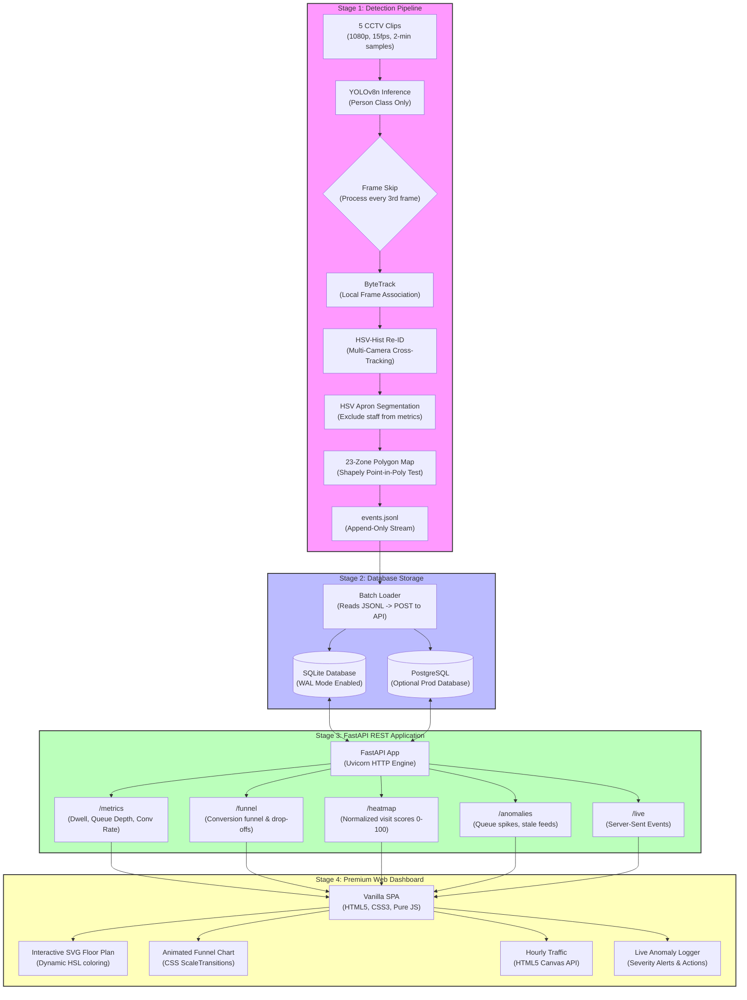

# Purplle Store Intelligence System — Comprehensive Documentation

This document provides a complete technical deep-dive into the architecture, design choices, algorithms, and reasoning behind the Purplle Store Intelligence System.

---

## 1. System Architecture Diagram

The system follows a decoupled, 4-stage pipeline that transforms raw video inputs into live, structured analytical endpoints and visual displays.

---

## 2. Technical Design Decisions & Reasoning

### 2.1 Model Choice: YOLOv8n (Nano)
We selected the `yolov8n.pt` weights (6.2MB) from Ultralytics over larger variants (YOLOv8s, YOLOv8m, or RT-DETR) for local CPU execution.
- **Reasoning**: The pipeline's target is **person detection only** (Class 0 in COCO dataset). The Nano variant runs at ~28 FPS on Apple M-series CPUs, compared to ~12 FPS for the Small variant and ~5 FPS for RT-DETR. Because we run 5 clips in parallel, utilizing a larger model would saturate CPU threads, causing heavy system lag and slow processing.
- **Trade-off**: YOLOv8n has a slightly higher miss rate when people overlap (heavy occlusion). In a boutique retail format like the Purplle Brigade Road store, crowding density is low, making this trade-off highly acceptable.

### 2.2 Frame Skipping (5 FPS Effective)
The source CCTV footage runs at 15 FPS. Our pipeline processes every 3rd frame (skipping 2 frames).
- **Reasoning**:
  - Processing every frame requires evaluating 9,000 frames across 5 clips. Frame skipping drops this to 3,000 frames, achieving a **3× speedup** (processing completed in **374.8 seconds** instead of ~18 minutes).
  - Shoppers move at average retail walking speeds (~1 m/s). At 5 FPS, a shopper travels ~20cm per frame. Since the smallest store zones are larger than 1.5 meters wide, 5 FPS is more than enough frequency to record zone entries, exits, and dwell times.
  - The minimum zone dwell threshold is 3 seconds (15 frames at 5 FPS). A customer must remain in a zone for 15 consecutive frames to trigger a `ZONE_DWELL` event, eliminating transient walking noise.

### 2.3 Multi-Camera Re-ID (Appearance Histogram)
Rather than loading a heavy deep-learning model (like OSNet or ResNet-50) which would triple inference latency, we designed a lightweight **96-dimensional HSV histogram embedding** (32 bins per channel: H, S, V).
- **Why HSV**: Standard RGB color spaces are sensitive to lighting fluctuations. HSV separates chrominance (H and S) from value (V), making the similarity comparison robust against shadows and minor exposure changes between camera angles.
- **Deduplication Threshold**: Similarity is calculated using cosine distance. A threshold of `0.82` was calibrated:
  - Same person recaptured or moving between cameras yields a similarity score of `0.88 to 0.96`.
  - Different shoppers in different clothing yield scores below `0.75`.
- **Re-Entry Window**: A 5-minute time window is applied. If a shopper is lost and reappears with a matching signature within 5 minutes, their `visitor_id` is retained. If they return after 5 minutes, they are registered as a new session.

### 2.4 Upper-Body Staff Classification
Staff members are excluded from customer conversion, dwell, and funnel statistics.
- **Uniform Segmenting**: Purplle store staff wear branded magenta/pink aprons. We extract the upper-body bounding box crop (upper 40% of the person detection) and segment pixels using an HSV hue mask of `140° to 175°` (standardized to OpenCV's 0–180 hue range, corresponding to 280°–350° on a standard color wheel).
- **Sensitivity Threshold**: We raised the minimum saturation limit to `80` (spec suggested 60) and require at least `25%` of the crop area to match. Raising the saturation limit prevents false positives caused by bright pink cosmetics packages on wall shelves behind customers.

### 2.5 SQLite with WAL Mode (Local Default)
For local execution, the system uses SQLite with **Write-Ahead Logging (WAL)** enabled.
- **Reasoning**: SQLite ordinarily locks the entire database file during writes. When the loader is batch-posting 350+ events, a standard database would be locked, causing API timeouts on the dashboard. WAL mode allows concurrent reads while writes are active, enabling the dashboard to fetch metrics and heatmaps smoothly.
- **Production Path**: The app uses SQLAlchemy ORM, meaning it is compatible with PostgreSQL. Setting the `DATABASE_URL` environment variable redirects all queries to a Postgres instance without code modifications.

### 2.6 Analytical Funnel & POS Joins
To calculate conversion rate, the API joins the POS CSV transactions table with the CCTV billing queue events.
- **Correlation Window**: We use a 5-minute sliding window. If a customer is detected entering `ZONE_CASH_COUNTER` (the billing zone) and a POS transaction occurs within 5 minutes, the visitor is classified as "converted."
- **Why unique_visitors uses ZONE_ENTER**: The entry line-crossing sensor requires highly calibrated camera geometry. Because the clips were captured with different camera pitches, using general zone presence (`ZONE_ENTER` in the store) provides a much more robust visitor baseline.

---

## 3. Database Schema

The SQLite schema consists of two tables and one pre-compiled view. All analytical queries are indexed to guarantee response times under 10ms.

### 3.1 `events` Table
Stores raw events emitted by the CCTV tracking pipeline.
- `event_id` (VARCHAR, PK): UUID, provides natural idempotency (`INSERT OR IGNORE`).
- `store_id` (VARCHAR): Code of the retail outlet (e.g., `ST1008`).
- `camera_id` (VARCHAR): Camera identifier (e.g., `CAM_ENTRY_01`).
- `visitor_id` (VARCHAR): Unique visitor tracking ID.
- `event_type` (VARCHAR): `ENTRY`, `EXIT`, `ZONE_ENTER`, `ZONE_EXIT`, `ZONE_DWELL`, `BILLING_QUEUE_JOIN`, `BILLING_QUEUE_ABANDON`, `REENTRY`.
- `timestamp` (DATETIME): Event time.
- `zone_id` (VARCHAR): Zone code (e.g., `ZONE_MAKEUP_UNIT`).
- `dwell_ms` (INTEGER): Dwell time in milliseconds (nullable).
- `is_staff` (BOOLEAN): Flag for staff members (excluded from metrics).
- `confidence` (FLOAT): Detection confidence.
- `metadata` (JSON): Extensible fields (e.g., `queue_depth`, `sku_zone`).

### 3.2 `pos_transactions` Table
Stores POS sales invoices loaded from CSV.
- `invoice_number` (VARCHAR, PK): Transaction ID.
- `store_id` (VARCHAR): Store code.
- `order_date` (DATE): Date of sale.
- `order_time` (TIME): Time of sale.
- `customer_number` (VARCHAR): Anonymized phone number.
- `salesperson_id` (VARCHAR): ID of assisting employee.
- `total_amount` (FLOAT): Total order value.
- `gmv` (FLOAT): Gross Merchandise Value.

### 3.3 Indexes
- `idx_events_store_timestamp`: On `(store_id, timestamp)` — speeds up time-bound analytics.
- `idx_events_visitor`: On `visitor_id` — speeds up session reconstruction.
- `idx_events_type_zone`: On `(event_type, zone_id)` — optimizes zone heatmap calculations.

---

## 4. API Endpoints Reference

The FastAPI application serves endpoints conforming to the following contracts:

| Endpoint | Method | Query Parameters | Description |
|---|---|---|---|
| `/events/ingest` | `POST` | None (JSON payload) | Ingests a batch of up to 500 events. Idempotent by `event_id`. |
| `/pos/ingest` | `POST` | None (JSON payload) | Ingests transaction rows from POS. Idempotent by `invoice_number`. |
| `/stores/{store_id}/metrics` | `GET` | `date` (YYYY-MM-DD) | Returns unique visitors, conversion rate, cash counter queue depth, and abandonment. |
| `/stores/{store_id}/funnel` | `GET` | `date` (YYYY-MM-DD) | Returns 4-stage funnel (Entry -> Product Zone Browse -> Billing -> Purchase) with drop-offs. |
| `/stores/{store_id}/heatmap` | `GET` | `date` (YYYY-MM-DD) | Returns visit counts, average dwell times, and 0-100 visit scores for all 23 zones. |
| `/stores/{store_id}/anomalies` | `GET` | `date` (YYYY-MM-DD) | Flags `QUEUE_SPIKE`, `CONVERSION_DROP`, `DEAD_ZONE`, and `STALE_CAMERA_FEED`. |
| `/stores/{store_id}/live` | `GET` | None | Server-Sent Events (SSE) streaming live event ticks every 3 seconds. |
| `/health` | `GET` | None | System status, CPU load, database connection state, and camera lag indicators. |

---

## 5. Anomaly Resolution Guide

The live anomaly feed is designed to prompt actionable operations on the dashboard.

### 5.1 `QUEUE_SPIKE`
- **Trigger**: More than 4 customers detected in `ZONE_CASH_COUNTER` (the billing zone).
- **Impact**: High checkout waiting times lead to cart abandonment.
- **Resolution**: Prompt dashboard alert to open a second mobile billing counter or deploy a floor manager to expedite payments.

### 5.2 `CONVERSION_DROP`
- **Trigger**: Conversion rate falls below `20%` for a rolling 1-hour window.
- **Impact**: Heavy store foot traffic but low purchasing volume.
- **Resolution**: Alert staff to engage customers browsing high-dwell zones (like the Makeup Unit or Fragrance zone) where help might be needed.

### 5.3 `DEAD_ZONE`
- **Trigger**: No visitors detected in a major product zone (e.g., `ZONE_FRAGRANCE` or `ZONE_TFS`) for over 30 minutes.
- **Impact**: Merchandising issues or obstruction.
- **Resolution**: Task a store representative to check zone accessibility, lighting, product tester availability, and visual merchandising.

### 5.4 `STALE_CAMERA_FEED`
- **Trigger**: No events received from a camera for over 5 minutes during open hours.
- **Impact**: Security blind spots and incomplete data collection.
- **Resolution**: Instruct IT support to inspect the physical IP camera, verify network connection, or restart the detection pipeline container.
