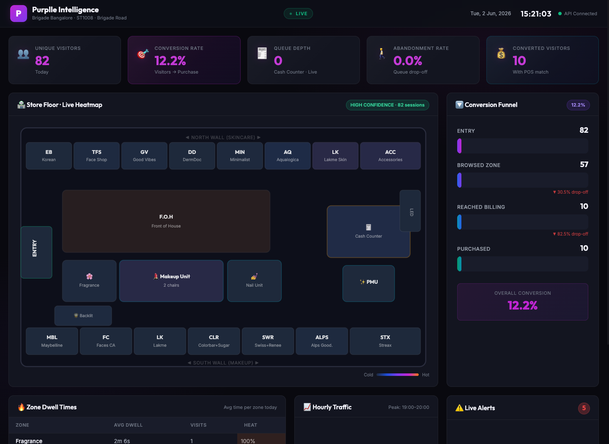

# Purplle Store Intelligence System — Features & Interface Guide

This document describes all the core software features, analytical metrics, and UI components of the Purplle Store Intelligence Dashboard.

---

## 🖥️ Live Dashboard Overview

Below is the live high-fidelity screenshot of the dashboard interface, styled in a dark glassmorphism theme using Purplle's magenta design language.

---

## 1. Key Performance Indicator (KPI) Cards

The top section of the dashboard displays 5 real-time metrics summarizing the store's performance for the selected date.

### 1.1 Unique Visitors
- **Description**: The count of distinct customer sessions detected throughout the store.
- **Algorithm**: Tracks unique `visitor_id` tokens. To filter out noise, visitors are counted based on zone entrance events (`ZONE_ENTER`), ensuring they step into a retail zone.
- **Staff Exclusion**: Employees are recognized by their magenta aprons and automatically excluded from this card.

### 1.2 Converted Visitors
- **Description**: The number of unique visitors who successfully completed a purchase.
- **Algorithm**: Detects customers who visited `ZONE_CASH_COUNTER` and match a transaction in the POS sales database on the same date.

### 1.3 Conversion Rate
- **Description**: The percentage of store entrants who make a purchase.
- **Formula**: `Converted Visitors ÷ Unique Visitors` (rounded to 1 decimal place).

### 1.4 Live Queue Depth
- **Description**: The number of shoppers currently standing in the checkout queue.
- **Algorithm**: Emits a live queue count from the billing camera feed based on active bounding boxes within the queue polygon coordinates.

### 1.5 Cart Abandonment Rate
- **Description**: The percentage of shoppers who join the billing queue but leave without making a purchase.
- **Formula**: `BILLING_QUEUE_ABANDON events ÷ BILLING_QUEUE_JOIN events`.

---

## 2. Interactive SVG Store Floor Plan (Heatmap)

The central component of the dashboard is an interactive layout map of the Brigade Bangalore (ST1008) outlet.

- **Hand-Authored SVG**: Scaled precisely to the store's physical dimensions based on the architectural CAD layout.
- **Zone Highlights**: Represents all **23 distinct zones** (skincare counters, makeup islands, cash desk, fragrance sections).
- **HSL Interpolation Heatmap**: Zones dynamically adjust their color based on their normalized **Visit Score (0–100)**:
  - **Cold Zones (Low traffic)**: Colored in deep, sleek slate blue.
  - **Mid-Traffic Zones**: Colored in rich royal purple.
  - **Hot Zones (High traffic)**: Colored in vibrant Purplle Magenta/Pink.
- **Interactive Tooltips**: Hovering over any zone on the map reveals a popup detailing:
  - **Total Visit Count** (unique sessions in that zone).
  - **Average Dwell Time** (in seconds or minutes).

---

## 3. Animated Conversion Funnel

A vertical, step-down chart visualizing customer progression and identifying where sales leaks occur.

- **Stage 1: Store Entry**: Baseline of all unique, non-staff visitors.
- **Stage 2: Product Browse**: Visitors who spent at least 3 seconds browsing standard cosmetic/skincare zones.
- **Stage 3: Reached Billing**: Visitors who approached the cashier desk.
- **Stage 4: Purchase (POS)**: Converted transactions.
- **Leakage Visualizer**: Displays a percentage drop-off label between stages. For example, a high drop-off between *Browse* and *Billing* highlights that shoppers are looking but leaving before checkout, signaling a need for salesperson intervention.

---

## 4. Live Anomaly Feed

A real-time monitoring panel that flags operational irregularities and alerts staff with color-coded severity badges.

- **Queue Spike (CRITICAL/WARN)**: Triggered when the billing queue exceeds 4 shoppers. Prompts staff to open a secondary mobile billing device.
- **Conversion Drop (WARN)**: Triggered if the conversion rate falls below `20%` during open hours. Suggests deploying floor associates to assist customers in high-dwell zones.
- **Dead Zone (INFO)**: Triggered if a primary product category area sees zero activity for 30+ minutes. Alerts staff to inspect the section for accessibility or display defects.
- **Stale Camera Feed (CRITICAL)**: Triggered if a camera feed stops reporting events for more than 10 minutes, notifying IT to inspect the network.

---

## 5. Dwell Time Leaderboard

A tabular view listing all zones sorted by engagement intensity.
- Shows total visit counts and average dwell times.
- Features horizontal, colored inline heatbars. A quick glance immediately shows which brands (e.g., Lakme, Minimalist, TFS) hold customer attention the longest (longest average dwell in the trial run was **Fragrance** at 62.9 seconds).

---

## 6. Hourly Traffic & Camera Health Hub

- **Hourly Traffic Chart**: A canvas-rendered bar chart depicting visitor entries per hour, highlighting peak shopping slots (typically 19:00 - 20:00).
- **Camera Health Bar**: Shows connection latencies and lag status (e.g., OK or STALE) for all 5 CCTV feeds, ensuring hardware integrity.
